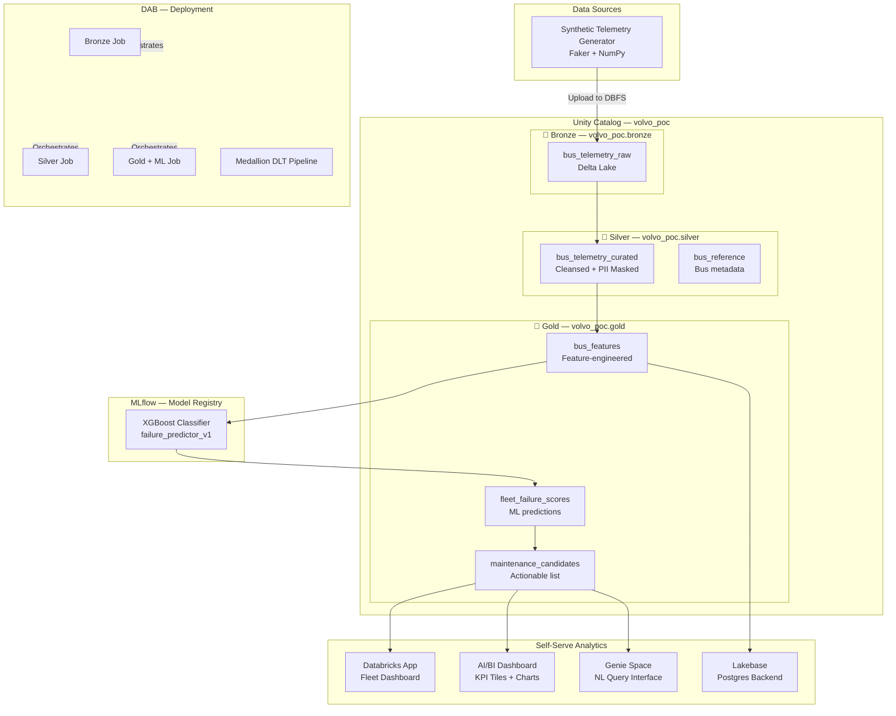
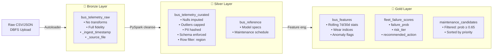
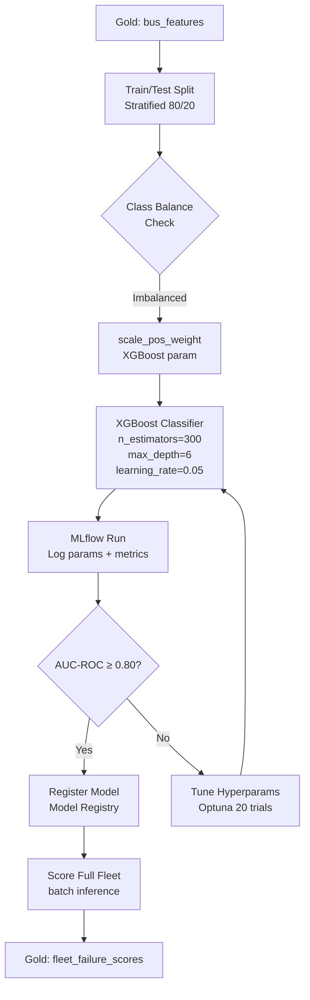
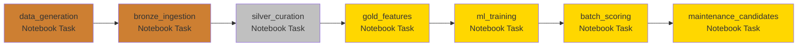

# Volvo Bus Predictive Maintenance — POC Implementation Plan

**Client:** Volvo Bus Company  
**Platform:** Databricks Free Edition  
**Workspace:** https://dbc-a4654756-d754.cloud.databricks.com  
**Execution Window:** 60 minutes  
**Author:** Arash Bakhtiary  
**Date:** 2026-05-24  

---

## Table of Contents

1. [Project Overview](#1-project-overview)
2. [Architecture](#2-architecture)
3. [Data Model](#3-data-model)
4. [60-Minute Execution Timeline](#4-60-minute-execution-timeline)
5. [Phase 0 — Environment Setup (0–5 min)](#phase-0--environment-setup-05-min)
6. [Phase 1 — Unity Catalog & Governance (5–10 min)](#phase-1--unity-catalog--governance-510-min)
7. [Phase 2 — Synthetic Data Generation (10–20 min)](#phase-2--synthetic-data-generation-1020-min)
8. [Phase 3 — Bronze Layer (20–28 min)](#phase-3--bronze-layer-2028-min)
9. [Phase 4 — Silver Layer (28–38 min)](#phase-4--silver-layer-2838-min)
10. [Phase 5 — Gold Layer & ML Pipeline (38–50 min)](#phase-5--gold-layer--ml-pipeline-3850-min)
11. [Phase 6 — Self-Serve Analytics (50–55 min)](#phase-6--self-serve-analytics-5055-min)
12. [Phase 7 — Unit Tests (55–58 min)](#phase-7--unit-tests-5558-min)
13. [Phase 8 — Git, Docs & DAB Deploy (58–60 min)](#phase-8--git-docs--dab-deploy-5860-min)
14. [Project Structure](#14-project-structure)
15. [Feature Specifications](#15-feature-specifications)
16. [Governance Design](#16-governance-design)
17. [Reliability & Disaster Recovery](#17-reliability--disaster-recovery)
18. [Debugging & Optimization Checklist](#18-debugging--optimization-checklist)

---

## 1. Project Overview

### Objective
Build a proof-of-concept predictive maintenance system for a fleet of 10 Volvo bus models. The system ingests telemetry data, applies a medallion architecture, trains a binary classifier, and surfaces insights via a Databricks App, AI/BI dashboard, and Genie space.

### KPI
**`next_14_days_failure`** — Probability that a bus will experience a maintenance-requiring failure within the next 14 days. Buses above a configurable threshold (default: 0.65) are flagged for preventive maintenance.

### Fleet
| # | Bus Model | Engine Type | Primary Use |
|---|-----------|-------------|-------------|
| 1 | Volvo 7900 Electric | BEV | Urban |
| 2 | Volvo 7700 | Diesel | Urban |
| 3 | Volvo 8900 | Diesel/Hybrid | Intercity |
| 4 | Volvo 9700 | Diesel | Coach |
| 5 | Volvo 9900 | Diesel | Luxury Coach |
| 6 | Volvo B5LH | Hybrid | Urban Double-Deck |
| 7 | Volvo B7R | Diesel | Regional |
| 8 | Volvo B8R | Diesel | Regional |
| 9 | Volvo B11R | Diesel | Long-Haul |
| 10 | Volvo B12B | Diesel | Long-Haul |

### Data Volume
- 10 bus models × 100,000 records = **1,000,000 rows** synthetic telemetry records
- Expected failure rate: ~8–12% (class-imbalanced, handled via SMOTE / scale_pos_weight)

---

## 2. Architecture

### 2.1 Overall System Architecture



### 2.2 Medallion Data Flow



### 2.3 ML Pipeline



### 2.4 DAB Pipeline Orchestration



---

## 3. Data Model

### 3.1 Schema: `volvo_poc.bronze.bus_telemetry_raw`

| Column | Type | Description |
|--------|------|-------------|
| `record_id` | STRING | UUID, primary key |
| `bus_id` | STRING | Unique bus identifier (e.g. `VOL-7900E-0042`) |
| `bus_model` | STRING | One of 10 Volvo models |
| `event_timestamp` | TIMESTAMP | Telemetry reading time |
| `odometer_km` | DOUBLE | Total distance travelled |
| `speed_kph` | DOUBLE | Instantaneous speed |
| `oil_pressure_bar` | DOUBLE | Engine oil pressure |
| `battery_voltage_v` | DOUBLE | System battery voltage |
| `vibration_ms2` | DOUBLE | Vibration (m/s²) |
| `ambient_temp_c` | DOUBLE | Ambient air temperature |
| `fuel_rate_lph` | DOUBLE | Fuel consumption (L/h) |
| `brake_wear_pct` | DOUBLE | Brake pad wear (0–100%) |
| `dpf_pressure_kpa` | DOUBLE | DPF differential pressure |
| `error_code_count` | INTEGER | Active DTC error code count |
| `engine_temp_c` | DOUBLE | Engine coolant temperature |
| `driver_id` | STRING | **PII** — Driver identifier |
| `route_id` | STRING | Route code |
| `depot_region` | STRING | Operating region |
| `next_14_days_failure` | INTEGER | Target: 0 = no failure, 1 = failure |
| `_ingest_timestamp` | TIMESTAMP | Autoloader ingest time |
| `_source_file` | STRING | Source file path |

### 3.2 Schema: `volvo_poc.silver.bus_telemetry_curated`

Inherits bronze columns plus:

| Column | Type | Description |
|--------|------|-------------|
| `driver_id_hashed` | STRING | SHA-256 hash of driver_id (PII masked) |
| `oil_pressure_anomaly` | BOOLEAN | True if outside [2.0, 7.0] bar |
| `engine_temp_anomaly` | BOOLEAN | True if outside [70, 105] °C |
| `battery_anomaly` | BOOLEAN | True if outside [22.0, 27.5] V |
| `is_valid_record` | BOOLEAN | Passed all quality checks |
| `_silver_timestamp` | TIMESTAMP | Silver processing time |

> `driver_id` column is **dropped** in Silver; only `driver_id_hashed` propagates.

### 3.3 Schema: `volvo_poc.gold.bus_features`

| Column | Type | Description |
|--------|------|-------------|
| `bus_id` | STRING | Bus identifier |
| `bus_model` | STRING | Model |
| `snapshot_date` | DATE | Feature computation date |
| `odometer_km` | DOUBLE | Latest reading |
| `brake_wear_pct` | DOUBLE | Latest |
| `avg_speed_7d` | DOUBLE | 7-day rolling avg speed |
| `avg_engine_temp_7d` | DOUBLE | 7-day rolling avg engine temp |
| `max_vibration_7d` | DOUBLE | 7-day max vibration |
| `error_code_sum_7d` | INTEGER | 7-day error code count sum |
| `avg_dpf_pressure_7d` | DOUBLE | 7-day avg DPF pressure |
| `brake_wear_index` | DOUBLE | Normalised wear score [0–1] |
| `anomaly_count_30d` | INTEGER | Count of anomalous readings in 30d |
| `composite_risk_score` | DOUBLE | Weighted risk composite |
| `next_14_days_failure` | INTEGER | Target label |

### 3.4 Schema: `volvo_poc.gold.fleet_failure_scores`

| Column | Type | Description |
|--------|------|-------------|
| `bus_id` | STRING | Bus identifier |
| `bus_model` | STRING | Model |
| `snapshot_date` | DATE | Scoring date |
| `failure_probability` | DOUBLE | ML-predicted P(failure) |
| `risk_tier` | STRING | HIGH / MEDIUM / LOW |
| `recommended_action` | STRING | IMMEDIATE / SCHEDULE / MONITOR |
| `model_version` | STRING | MLflow model version |
| `scored_at` | TIMESTAMP | Inference timestamp |

---

## 4. 60-Minute Execution Timeline

```mermaid
gantt
    title POC Execution Timeline — 60 Minutes
    dateFormat mm
    axisFormat %M min

    section Phase 0: Setup
    GitHub repo + DAB init          :p0, 00, 5m

    section Phase 1: Governance
    Unity Catalog + schemas + ACLs  :p1, 05, 5m

    section Phase 2: Data
    Synthetic data generator        :p2, 10, 10m

    section Phase 3: Bronze
    Raw ingestion + Autoloader      :p3, 20, 8m

    section Phase 4: Silver
    Curation + PII + row filters    :p4, 28, 10m

    section Phase 5: Gold + ML
    Features + XGBoost + MLflow     :p5, 38, 12m

    section Phase 6: Analytics
    App + Dashboard + Genie         :p6, 50, 5m

    section Phase 7: Tests
    Unit tests                      :p7, 55, 3m

    section Phase 8: Git + DAB
    README + commit + deploy        :p8, 58, 2m
```



---

## Phase 0 — Environment Setup (0–5 min)

### Tasks
1. Create GitHub repository `volvo-predictive-maintenance` (public)
2. Clone locally and initialise DAB project (`databricks bundle init`)
3. Install local Python dependencies: `faker`, `numpy`, `scipy`, `pandas`, `xgboost`, `mlflow`, `pytest`
4. Verify Databricks CLI auth (`databricks auth profiles`)
5. Confirm Serverless Starter Warehouse is available

### Commands
```bash
# GitHub
gh repo create volvo-predictive-maintenance --public --description "Volvo Bus Predictive Maintenance POC — Databricks"
cd ~ && git clone https://github.com/Arash-Bakhtiary/volvo-predictive-maintenance
cd volvo-predictive-maintenance

# DAB init
databricks bundle init --template default

# Python deps
pip install faker numpy scipy pandas xgboost mlflow scikit-learn imbalanced-learn pytest pyspark
```

### Debugging Checkpoints
- [ ] `gh auth status` shows `Logged in as Arash-Bakhtiary`
- [ ] `databricks auth profiles` shows DEFAULT as Valid
- [ ] `databricks warehouses list` shows Serverless warehouse

---

## Phase 1 — Unity Catalog & Governance (5–10 min)

### Tasks
1. Create catalog `volvo_poc`
2. Create schemas: `bronze`, `silver`, `gold`
3. Create storage credentials and external location (DBFS for Free Edition)
4. Define column masks for PII fields
5. Define row-level filters by `depot_region`
6. Grant `USE CATALOG`, `USE SCHEMA`, `SELECT` to `account users`

### SQL DDL

```sql
-- Catalog
CREATE CATALOG IF NOT EXISTS volvo_poc
  COMMENT 'Volvo Bus Predictive Maintenance POC';

-- Schemas
CREATE SCHEMA IF NOT EXISTS volvo_poc.bronze
  COMMENT 'Raw ingestion layer — full fidelity, no transformations';
CREATE SCHEMA IF NOT EXISTS volvo_poc.silver
  COMMENT 'Curated layer — cleansed, validated, PII masked';
CREATE SCHEMA IF NOT EXISTS volvo_poc.gold
  COMMENT 'Feature and prediction layer — business-ready';
CREATE SCHEMA IF NOT EXISTS volvo_poc.ml
  COMMENT 'MLflow experiments and registered models';

-- PII Column Mask: driver_id returns NULL unless user is in data_stewards group
CREATE OR REPLACE FUNCTION volvo_poc.silver.mask_driver_id(driver_id_hashed STRING)
  RETURN CASE
    WHEN is_member('data_stewards') THEN driver_id_hashed
    ELSE '*** MASKED ***'
  END;

-- Row Filter: users only see their depot_region (or all if admin)
CREATE OR REPLACE FUNCTION volvo_poc.gold.filter_by_region(depot_region STRING)
  RETURN is_member('admins') OR depot_region = current_user();

-- Apply mask to silver table (post-creation)
-- ALTER TABLE volvo_poc.silver.bus_telemetry_curated
--   ALTER COLUMN driver_id_hashed SET MASK volvo_poc.silver.mask_driver_id;

-- Apply row filter to gold table (post-creation)
-- ALTER TABLE volvo_poc.gold.fleet_failure_scores
--   SET ROW FILTER volvo_poc.gold.filter_by_region ON (depot_region);

-- Grants
GRANT USE CATALOG ON CATALOG volvo_poc TO `account users`;
GRANT USE SCHEMA, SELECT ON SCHEMA volvo_poc.gold TO `account users`;
GRANT USE SCHEMA ON SCHEMA volvo_poc.silver TO `account users`;
```

### Debugging Checkpoints
- [ ] `databricks catalogs list` shows `volvo_poc`
- [ ] `databricks schemas list volvo_poc` shows bronze, silver, gold, ml
- [ ] Column mask function created without errors

---

## Phase 2 — Synthetic Data Generation (10–20 min)

### Design Principles
- Each of the 10 bus models has **distinct parameter distributions** reflecting real-world engineering specs
- Failure label generated via a logistic function of risk factors (not random), ensuring predictive signal
- Target class imbalance: ~10% failure rate (realistic for a maintained fleet)
- Faker used for: `bus_id`, `driver_id`, `route_id`, `record_id`, `event_timestamp`

### Feature Distributions by Bus Model

| Feature | Distribution | Parameters |
|---------|-------------|------------|
| `odometer_km` | LogNormal | μ=12.0, σ=0.8 (→ median ~162k km) |
| `speed_kph` | Beta(2,3) × 130 | Peaks at ~50 kph |
| `oil_pressure_bar` | Normal | μ=4.2, σ=0.6, clip[1.5, 8.0] |
| `battery_voltage_v` | Normal | μ=24.5, σ=0.8, clip[20, 29] |
| `vibration_ms2` | LogNormal | μ=0.5, σ=0.4, clip[0, 5] |
| `ambient_temp_c` | Normal | μ=12, σ=15, clip[-25, 42] |
| `fuel_rate_lph` | LogNormal | μ=2.8, σ=0.3 (model-specific offset) |
| `brake_wear_pct` | Beta(2,5) × 100 | Higher odometer → higher wear |
| `dpf_pressure_kpa` | LogNormal | μ=1.2, σ=0.5, clip[0.1, 15] |
| `error_code_count` | Poisson | λ=0.8 (spikes near failures) |
| `engine_temp_c` | Normal | μ=87, σ=8, clip[60, 120] |

### Failure Label Generation (Logistic)

```python
def compute_failure_probability(row):
    """Logistic combination of risk factors — ensures predictive signal."""
    score = 0.0
    score += 2.5 * (row['brake_wear_pct'] / 100)          # brake wear dominant
    score += 1.8 * min(row['error_code_count'] / 5, 1.0)  # error codes
    score += 1.2 * (row['dpf_pressure_kpa'] / 15)         # DPF pressure
    score += 1.0 * (row['odometer_km'] / 800_000)          # age proxy
    score += 0.8 * max(0, (row['engine_temp_c'] - 100) / 20)
    score += 0.6 * max(0, (row['vibration_ms2'] - 2.0) / 3)
    score -= 0.5 * (row['oil_pressure_bar'] / 7)           # good pressure = safer
    prob = 1 / (1 + math.exp(-score + 3.5))               # logistic, offset to ~10%
    return int(random.random() < prob)
```

### Key File: `src/data_generation/generate_synthetic_data.py`
- Outputs: `data/raw/bus_telemetry_{model}.csv` (one file per model)
- Total: ~1M rows, ~250 MB uncompressed
- Runtime target: < 3 minutes on local machine

### Debugging Checkpoints
- [ ] All 10 CSV files generated, each exactly 100,000 rows
- [ ] Failure rate per model: 6–14% (check with `df['next_14_days_failure'].mean()`)
- [ ] No nulls in non-nullable columns
- [ ] Schema validates against bronze DDL

---

## Phase 3 — Bronze Layer (20–28 min)

### Tasks
1. Upload generated CSVs to DBFS (`dbfs:/FileStore/volvo_poc/raw/`)
2. Create `bus_telemetry_raw` Delta table
3. Use **Databricks Autoloader** (`cloudFiles`) for incremental ingestion
4. Add `_ingest_timestamp` and `_source_file` metadata columns
5. Enable Delta Change Data Feed for downstream CDC

### Notebook: `notebooks/01_bronze_ingestion.py`

```python
# Key logic outline
spark.readStream \
    .format("cloudFiles") \
    .option("cloudFiles.format", "csv") \
    .option("cloudFiles.schemaLocation", schema_location) \
    .option("header", "true") \
    .option("inferSchema", "false") \
    .schema(bronze_schema) \
    .load(raw_path) \
    .withColumn("_ingest_timestamp", current_timestamp()) \
    .withColumn("_source_file", input_file_name()) \
    .writeStream \
    .format("delta") \
    .option("checkpointLocation", checkpoint_location) \
    .option("mergeSchema", "false") \
    .trigger(availableNow=True) \
    .toTable("volvo_poc.bronze.bus_telemetry_raw")
```

### Delta Table Properties
```sql
ALTER TABLE volvo_poc.bronze.bus_telemetry_raw
  SET TBLPROPERTIES (
    'delta.enableChangeDataFeed' = 'true',
    'delta.autoOptimize.optimizeWrite' = 'true',
    'delta.autoOptimize.autoCompact' = 'true',
    'quality' = 'bronze',
    'team' = 'data-engineering',
    'pii' = 'true'
  );
```

### Debugging Checkpoints
- [ ] `SELECT COUNT(*) FROM volvo_poc.bronze.bus_telemetry_raw` = 1,000,000
- [ ] `_ingest_timestamp` and `_source_file` populated
- [ ] Delta history shows clean WRITE operation
- [ ] Autoloader checkpoint written to DBFS

---

## Phase 4 — Silver Layer (28–38 min)

### Tasks
1. Read from Bronze with schema validation
2. Impute nulls: median for continuous, mode for categorical
3. Cap outliers: IQR-based per feature per bus model
4. Hash `driver_id` → `driver_id_hashed` (SHA-256), drop original
5. Add boolean anomaly flag columns
6. Apply **column mask** on `driver_id_hashed`
7. Apply **row-level filter** on `depot_region`
8. Write as partitioned Delta table (partition by `bus_model`, `date(event_timestamp)`)
9. Run Great Expectations-style quality assertions

### PII Fields
| Field | Classification | Treatment |
|-------|---------------|-----------|
| `driver_id` | PII — Personal identifier | SHA-256 hash, original dropped |
| `bus_id` | Pseudonymous | Retained (not personally identifiable) |
| `route_id` | Operational | Retained |

### Data Quality Rules
```python
quality_rules = {
    "no_null_bus_id": "bus_id IS NOT NULL",
    "valid_speed": "speed_kph BETWEEN 0 AND 200",
    "valid_oil_pressure": "oil_pressure_bar BETWEEN 0 AND 15",
    "valid_battery": "battery_voltage_v BETWEEN 10 AND 35",
    "valid_brake_wear": "brake_wear_pct BETWEEN 0 AND 100",
    "valid_target": "next_14_days_failure IN (0, 1)",
    "valid_engine_temp": "engine_temp_c BETWEEN 40 AND 150",
}
```

### Notebook: `notebooks/02_silver_curation.py`

### Debugging Checkpoints
- [ ] Zero nulls in critical columns after imputation
- [ ] `driver_id` column absent from silver table
- [ ] Column mask function attached and tested (non-steward sees `*** MASKED ***`)
- [ ] Data quality pass rate ≥ 99.5%
- [ ] Row count: Bronze ≥ Silver (some records filtered as invalid)

---

## Phase 5 — Gold Layer & ML Pipeline (38–50 min)

### 5a. Gold Feature Engineering (38–44 min)

#### Tasks
1. Join silver telemetry with bus reference data
2. Compute rolling 7-day and 30-day statistics per bus_id
3. Compute `brake_wear_index`, `anomaly_count_30d`, `composite_risk_score`
4. Write `volvo_poc.gold.bus_features`

#### Key Transformation
```python
from pyspark.sql import Window
import pyspark.sql.functions as F

window_7d = Window.partitionBy("bus_id") \
    .orderBy(F.unix_timestamp("event_timestamp")) \
    .rangeBetween(-7*86400, 0)

df_gold = df_silver \
    .withColumn("avg_speed_7d", F.avg("speed_kph").over(window_7d)) \
    .withColumn("avg_engine_temp_7d", F.avg("engine_temp_c").over(window_7d)) \
    .withColumn("max_vibration_7d", F.max("vibration_ms2").over(window_7d)) \
    .withColumn("error_code_sum_7d", F.sum("error_code_count").over(window_7d)) \
    .withColumn("brake_wear_index", F.col("brake_wear_pct") / 100.0)
```

### 5b. ML Training Pipeline (44–50 min)

#### Model: XGBoost Binary Classifier

```python
import mlflow, xgboost as xgb
from sklearn.model_selection import train_test_split
from sklearn.metrics import roc_auc_score, f1_score, precision_score, recall_score

mlflow.set_experiment("/volvo-poc/failure-predictor")

with mlflow.start_run(run_name="xgboost_baseline"):
    model = xgb.XGBClassifier(
        n_estimators=300,
        max_depth=6,
        learning_rate=0.05,
        scale_pos_weight=neg/pos,   # handle class imbalance
        use_label_encoder=False,
        eval_metric="auc",
        random_state=42
    )
    model.fit(X_train, y_train, eval_set=[(X_val, y_val)], early_stopping_rounds=20)
    
    preds = model.predict_proba(X_test)[:, 1]
    auc   = roc_auc_score(y_test, preds)
    f1    = f1_score(y_test, preds > 0.5)
    
    mlflow.log_params(model.get_params())
    mlflow.log_metrics({"auc_roc": auc, "f1": f1})
    mlflow.xgboost.log_model(model, "model",
        registered_model_name="volvo_bus_failure_predictor")
```

#### Success Criteria
| Metric | Minimum Threshold |
|--------|------------------|
| AUC-ROC | ≥ 0.80 |
| F1 Score | ≥ 0.70 |
| Precision (HIGH risk) | ≥ 0.75 |
| Recall (failures) | ≥ 0.72 |

#### Batch Scoring → `volvo_poc.gold.fleet_failure_scores`
- Load registered model from MLflow Model Registry
- Score all buses on latest feature snapshot
- Classify into risk tiers: HIGH (≥0.65), MEDIUM (0.40–0.65), LOW (<0.40)
- Write results to `fleet_failure_scores` with model version metadata

### Debugging Checkpoints
- [ ] MLflow experiment visible in Databricks UI
- [ ] AUC-ROC ≥ 0.80 (if not, trigger Optuna tuning)
- [ ] Model registered in Unity Catalog Model Registry (`volvo_poc.ml.bus_failure_predictor`)
- [ ] `fleet_failure_scores` row count matches `bus_features`
- [ ] Risk tier distribution: ~10% HIGH, ~25% MEDIUM, ~65% LOW

---

## Phase 6 — Self-Serve Analytics (50–55 min)

### 6a. Databricks App

**App Type:** Full-stack Python (Dash/Streamlit via AppKit)  
**Backend:** Lakebase (Postgres on Databricks) — synced from `gold.fleet_failure_scores`  
**File:** `src/app/app.py`

**Features:**
- Fleet map: colour-coded risk by depot region
- Top-10 buses needing immediate maintenance (table)
- Failure probability distribution histogram
- Bus drill-down: feature trends and anomaly timeline
- Real-time sync with Gold layer via Lakebase

**Lakebase Setup:**
```bash
databricks lakebase create --name volvo-poc-db
databricks lakebase sync --table volvo_poc.gold.fleet_failure_scores --target volvo-poc-db
```

### 6b. AI/BI Dashboard

**Name:** `Volvo Bus Fleet — Predictive Maintenance`

**KPI Tiles:**
- Total buses in fleet: 10 models × unique bus IDs
- Buses flagged HIGH risk today
- Average failure probability across fleet
- % fleet with brake_wear > 80%

**Charts:**
- Bar: Failure probability by bus model
- Line: Rolling 30-day failure rate trend
- Scatter: Odometer vs failure probability (coloured by risk tier)
- Pie: Risk tier distribution
- Table: maintenance_candidates with recommended action

### 6c. Genie Space

**Name:** `Fleet Maintenance Q&A`  
**Connected Table:** `volvo_poc.gold.fleet_failure_scores`  
**Trusted Assets:** `volvo_poc.gold.bus_features`, `volvo_poc.gold.maintenance_candidates`

**Sample Questions to Seed:**
- "Which buses have the highest failure probability this week?"
- "Show me all HIGH risk Volvo B11R buses"
- "What is the average brake wear for buses due for maintenance?"
- "How many buses need immediate action today?"
- "Which depot region has the most at-risk buses?"

### Debugging Checkpoints
- [ ] Databricks App accessible via workspace URL
- [ ] Lakebase synced — query Postgres via app
- [ ] AI/BI dashboard loads with all 5 KPI tiles
- [ ] Genie returns correct SQL for sample questions

---

## Phase 7 — Unit Tests (55–58 min)

### Test Files

**`tests/test_data_generation.py`**
```python
def test_row_count():          # 1M total rows
def test_failure_rate():       # 6–14% per model
def test_no_nulls():           # required fields
def test_schema_compliance():  # dtypes match DDL
def test_feature_ranges():     # all values within expected bounds
```

**`tests/test_silver_curation.py`**
```python
def test_pii_removal():        # driver_id absent
def test_hash_deterministic(): # same input → same hash
def test_anomaly_flags():      # correct boolean logic
def test_outlier_capping():    # no values beyond caps
def test_quality_rules():      # all rules pass on clean data
```

**`tests/test_gold_features.py`**
```python
def test_rolling_stats():      # 7d avg correct on known data
def test_brake_wear_index():   # [0, 1] range
def test_risk_score_range():   # composite_risk_score ≥ 0
def test_no_future_leakage():  # target not in feature set
```

**`tests/test_ml_pipeline.py`**
```python
def test_model_loads():        # MLflow model loadable
def test_predictions_range():  # probabilities in [0, 1]
def test_risk_tier_logic():    # HIGH/MEDIUM/LOW boundaries
```

### Run Tests
```bash
pytest tests/ -v --tb=short --cov=src --cov-report=term-missing
```

### Debugging Checkpoints
- [ ] All tests pass (`pytest` exit code 0)
- [ ] Coverage ≥ 80% on `src/`

---

## Phase 8 — Git, Docs & DAB Deploy (58–60 min)

### Git Commit Strategy
```bash
git add .
git commit -m "feat: initial POC — medallion pipeline + XGBoost + analytics"
git push origin main
```

### DAB Deployment

**`databricks.yml` targets:**
```yaml
targets:
  dev:
    mode: development
    workspace:
      host: https://dbc-a4654756-d754.cloud.databricks.com
  prod:
    mode: production
    workspace:
      host: https://dbc-a4654756-d754.cloud.databricks.com
```

```bash
# Validate bundle
databricks bundle validate

# Deploy to dev
databricks bundle deploy --target dev

# Run full pipeline
databricks bundle run --target dev volvo_poc_pipeline
```

### Debugging Checkpoints
- [ ] `databricks bundle validate` — no errors
- [ ] `databricks bundle deploy` — resources created in workspace
- [ ] Pipeline job visible in Databricks Jobs UI
- [ ] Full end-to-end run completes without errors

---

## 14. Project Structure

```
volvo-predictive-maintenance/
├── databricks.yml                        # DAB root config
├── PLAN.md                               # This document
├── README.md                             # Comprehensive readme + diagrams
├── pyproject.toml                        # Python project config
├── requirements.txt                      # Dependencies
│
├── resources/                            # DAB resource definitions
│   ├── jobs/
│   │   └── volvo_poc_pipeline.yml        # Full pipeline job
│   └── pipelines/
│       └── medallion_dlt.yml             # DLT pipeline (optional)
│
├── notebooks/                            # Databricks notebooks
│   ├── 00_setup_unity_catalog.sql        # Catalog + schema + governance
│   ├── 01_bronze_ingestion.py
│   ├── 02_silver_curation.py
│   ├── 03_gold_features.py
│   ├── 04_ml_training.py
│   ├── 05_batch_scoring.py
│   └── 06_maintenance_candidates.py
│
├── src/
│   ├── data_generation/
│   │   └── generate_synthetic_data.py
│   ├── bronze/
│   │   └── ingest.py
│   ├── silver/
│   │   ├── curate.py
│   │   └── pii.py
│   ├── gold/
│   │   ├── features.py
│   │   └── scoring.py
│   ├── ml/
│   │   ├── train.py
│   │   └── predict.py
│   └── app/
│       ├── app.py
│       └── requirements.txt
│
├── tests/
│   ├── conftest.py
│   ├── test_data_generation.py
│   ├── test_silver_curation.py
│   ├── test_gold_features.py
│   └── test_ml_pipeline.py
│
├── unity_catalog/
│   ├── 00_catalog_and_schemas.sql
│   ├── 01_column_masks.sql
│   ├── 02_row_filters.sql
│   └── 03_grants.sql
│
└── docs/
    └── architecture.md
```

---

## 15. Feature Specifications

### Bus-Model-Specific Parameter Offsets

| Bus Model | Fuel Rate Offset | Vibration Offset | Odometer Median |
|-----------|-----------------|-----------------|-----------------|
| 7900 Electric | -60% (electric) | -20% | 80k km |
| 7700 | baseline | baseline | 150k km |
| 8900 | +5% | +5% | 200k km |
| 9700 | +8% | +10% | 250k km |
| 9900 | +12% | +8% | 300k km |
| B5LH | -30% (hybrid) | baseline | 180k km |
| B7R | +3% | +5% | 220k km |
| B8R | +6% | +8% | 240k km |
| B11R | +15% | +15% | 400k km |
| B12B | +20% | +18% | 500k km |

---

## 16. Governance Design

### Unity Catalog Hierarchy
```
volvo_poc (Catalog)
├── bronze  (Schema)  — data engineers only (write), analysts (read)
├── silver  (Schema)  — data engineers only (write), analysts (read, PII masked)
├── gold    (Schema)  — all users (read, row-filtered), models (read/write)
└── ml      (Schema)  — MLflow experiments, registered models
```

### Roles & Groups
| Group | Permissions |
|-------|-------------|
| `data_engineers` | WRITE on bronze, silver, gold; EXECUTE functions |
| `data_stewards` | See unmasked `driver_id_hashed`; audit access logs |
| `analysts` | SELECT on silver (masked), gold (row-filtered) |
| `account users` | USE CATALOG, USE SCHEMA on gold |

### PII Register
| Field | Table | Classification | Treatment |
|-------|-------|---------------|-----------|
| `driver_id` | bronze | PII | Hashed before silver; dropped after |
| `driver_id_hashed` | silver | Pseudonymous PII | Column mask (non-stewards see `*** MASKED ***`) |

### Audit Logging
- Unity Catalog system tables: `system.access.audit`
- Monitor for: unexpected `SELECT` on bronze, access to unmasked columns

---

## 17. Reliability & Disaster Recovery

### Delta Lake Features Enabled
| Feature | Purpose |
|---------|---------|
| Time Travel | Roll back to any version within 30 days |
| Change Data Feed | Efficient incremental Silver/Gold updates |
| Auto Optimize | Prevent small-file problem |
| Z-ORDER on `bus_id` | Faster per-bus queries |

### Recovery Procedures

**Scenario 1: Bronze corruption**
```sql
-- Restore to previous version
RESTORE TABLE volvo_poc.bronze.bus_telemetry_raw
  TO VERSION AS OF <version_number>;
```

**Scenario 2: Bad Silver transformation**
```sql
RESTORE TABLE volvo_poc.silver.bus_telemetry_curated
  TO TIMESTAMP AS OF '2026-05-24T10:00:00';
```

**Scenario 3: Model degradation**
- MLflow Model Registry maintains all versions
- Rollback: transition previous version back to `Production` stage

### Checkpointing
- Autoloader checkpoint stored in DBFS (`dbfs:/checkpoints/volvo_poc/bronze/`)
- Streaming jobs use `trigger(availableNow=True)` — idempotent reruns safe

### Monitoring
- Databricks Jobs: email alert on failure
- Data quality: assert checks fail the job if pass rate < 99%
- Model drift: schedule weekly AUC recalculation job

---

## 18. Debugging & Optimization Checklist

### Data Issues
- [ ] Failure rate outside 6–14%? → Adjust logistic offset in generator
- [ ] Too many null records? → Check CSV delimiter and header parsing
- [ ] Schema mismatch? → Re-run bronze with `mergeSchema=True` then lock

### Performance Issues
- [ ] Silver job > 10 min? → Increase cluster size or use Photon
- [ ] Gold rolling windows slow? → Z-ORDER by `bus_id`, cache intermediate DF
- [ ] ML training > 5 min? → Reduce `n_estimators` to 100 for POC speed

### ML Issues
- [ ] AUC < 0.80? → Run Optuna tuning (20 trials, 5-min timeout)
- [ ] High precision, low recall? → Lower classification threshold from 0.65 to 0.50
- [ ] Feature importance flat? → Check for data leakage (target column in features)

### Deployment Issues
- [ ] `bundle validate` fails? → Check YAML indentation, resource name conflicts
- [ ] Notebook not found? → Ensure paths in `databricks.yml` are relative to bundle root
- [ ] App not loading? → Check Lakebase sync status, app logs in workspace UI

---

*Plan version: 1.0.0 | Created: 2026-05-24 | Status: Ready for execution*
