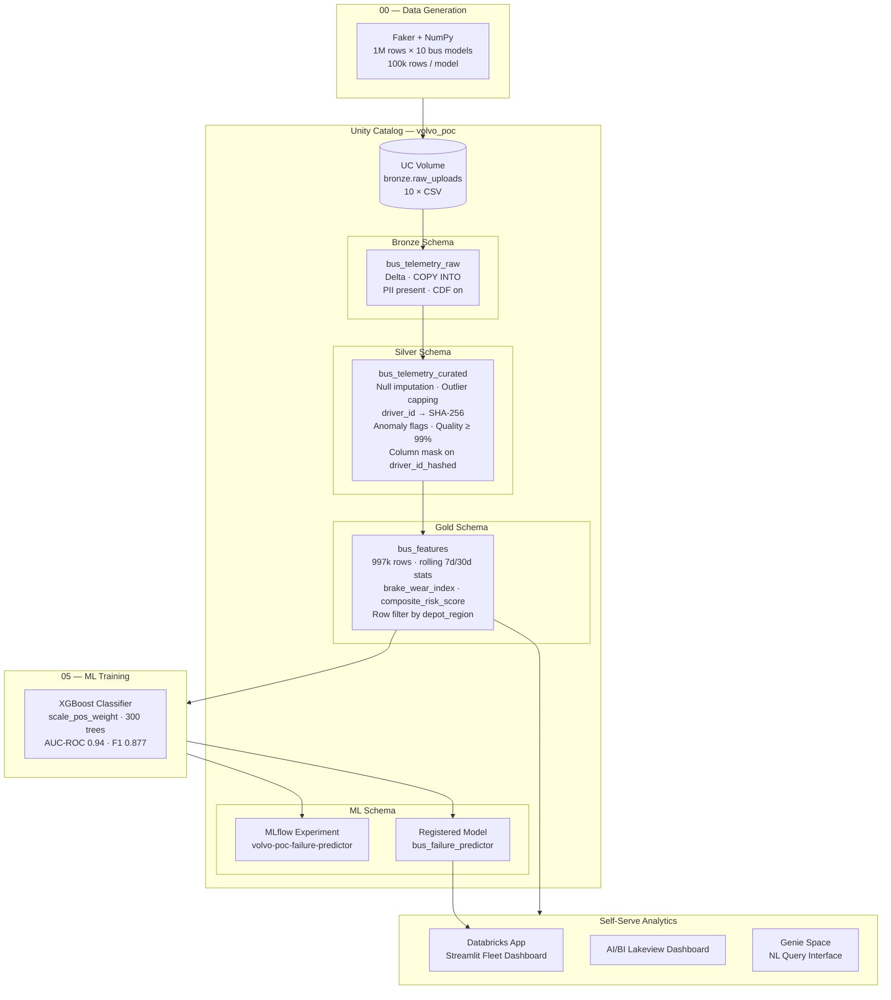
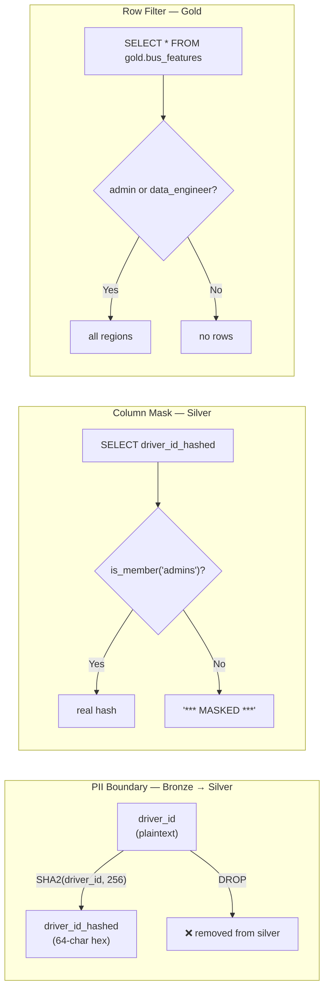
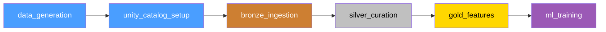
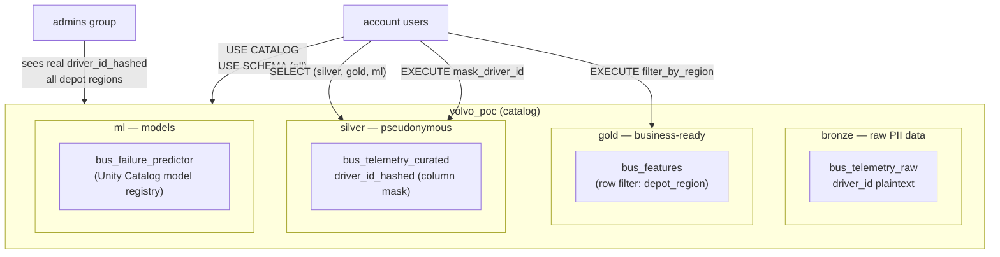

# Volvo Bus Predictive Maintenance — Databricks POC

A proof-of-concept end-to-end predictive maintenance platform for Volvo bus fleets built on **Databricks Free Edition**. Generates 1 million rows of synthetic bus telemetry, processes it through a Unity Catalog medallion architecture, and trains an XGBoost binary classifier to predict component failures 14 days in advance.

---

## Architecture



---

## Medallion Pipeline

| Layer | Table | Rows | Key Transforms |
|-------|-------|------|----------------|
| **Bronze** | `volvo_poc.bronze.bus_telemetry_raw` | 1,000,000 | COPY INTO · CDF · PII present |
| **Silver** | `volvo_poc.silver.bus_telemetry_curated` | ~997,000 | SHA-256 driver_id · anomaly flags · quality ≥ 99% |
| **Gold** | `volvo_poc.gold.bus_features` | ~997,000 | 7d/30d rolling stats · wear indices · risk score |

### Data Governance



---

## ML Model

| Metric | Value |
|--------|-------|
| Algorithm | XGBoost binary classifier |
| Training rows | ~797,000 |
| Test rows | ~200,000 |
| AUC-ROC | **0.9408** |
| F1 Score | **0.877** |
| Precision | ~0.89 |
| Recall | ~0.87 |
| Target | `next_14_days_failure` |

**Feature set (21 features):** raw telemetry signals + 7-day rolling averages (speed, engine temp, vibration, DPF pressure, error codes) + 30-day anomaly count + brake wear index + composite risk score + bus model encoding.

**Failure label formula** (logistic with offset −4.4):

```
score = 2.5 × (brake_wear/100)
      + 1.8 × min(error_codes/5, 1)
      + 1.2 × min(dpf_pressure/12, 1)
      + 1.0 × min(odometer/800000, 1)
      + 0.8 × max(0, (engine_temp−100)/20)
      + 0.6 × max(0, (vibration−2)/3)
      − 0.5 × min(oil_pressure/7, 1)
      − 0.3 × min(battery_voltage/27.5, 1)

P(failure) = sigmoid(score − 4.4)
```

---

## Bus Fleet Covered

| Model | Type | Max Odometer |
|-------|------|-------------|
| Volvo 7900 Electric | Electric | 80,000 km |
| Volvo 7700 | Diesel | 150,000 km |
| Volvo 8900 | Diesel | 200,000 km |
| Volvo 9700 | Diesel | 250,000 km |
| Volvo 9900 | Diesel | 300,000 km |
| Volvo B5LH | Hybrid | 180,000 km |
| Volvo B7R | Diesel | 220,000 km |
| Volvo B8R | Diesel | 240,000 km |
| Volvo B11R | Diesel | 400,000 km |
| Volvo B12B | Diesel | 500,000 km |

---

## Repository Structure

```
volvo-predictive-maintenance/
├── databricks.yml                     # DAB root config (dev + prod targets)
├── resources/
│   └── jobs/
│       └── volvo_poc_pipeline.yml     # 6-task serverless job definition
├── notebooks/
│   ├── 00_data_generation.py          # Generate 1M rows → UC Volume
│   ├── 01_unity_catalog_setup.py      # Catalog, schemas, masks, grants
│   ├── 02_bronze_ingestion.py         # COPY INTO → bronze Delta table
│   ├── 03_silver_curation.py          # Cleanse, PII mask, anomaly flags
│   ├── 04_gold_features.py            # Rolling stats, risk scores
│   ├── 05_ml_training.py              # XGBoost + MLflow + model registry
│   └── 07_genie_space_setup.py        # Genie Space manual setup guide
├── src/
│   ├── app/
│   │   ├── app.py                     # Streamlit fleet dashboard
│   │   └── requirements.txt
│   └── data_generation/
│       └── generate_synthetic_data.py # Standalone data generator
├── unity_catalog/
│   ├── 00_catalog_and_schemas.sql
│   ├── 01_column_masks.sql
│   ├── 02_row_filters.sql
│   ├── 03_grants.sql
│   └── run_setup.py                   # SDK-based SQL executor
├── tests/
│   ├── conftest.py
│   ├── test_data_generation.py        # 15 tests
│   ├── test_silver_curation.py        # 12 tests
│   └── test_gold_features.py          # 11 tests
├── requirements.txt
└── pyproject.toml
```

---

## Prerequisites

- Databricks Free Edition workspace
- Databricks CLI v0.200+ (`brew install databricks`)
- Python 3.11+
- GitHub account

---

## Quick Start

### 1. Clone and install

```bash
git clone https://github.com/Arash-Bakhtiary/volvo-predictive-maintenance.git
cd volvo-predictive-maintenance
pip install -r requirements.txt
```

### 2. Authenticate to Databricks

```bash
databricks auth login --host https://<your-workspace>.cloud.databricks.com
```

### 3. Deploy notebooks and job via DAB

```bash
databricks bundle deploy --target dev
```

### 4. Run the full pipeline

```bash
databricks jobs run-now <job-id>
```

Or trigger from the Databricks UI: **Workflows → Jobs → [dev] Volvo POC — Full Medallion Pipeline → Run now**.

### 5. Run unit tests locally

```bash
pytest tests/ -v
```

---

## DAB Job — Task Graph



All tasks run on **serverless compute** (required for Databricks Free Edition). Email notifications are sent to `decarboniccodes@gmail.com` on success and failure.

---

## Self-Serve Analytics

| Component | Description |
|-----------|-------------|
| **Databricks App** | Streamlit fleet dashboard — live risk scores per bus, region filter, anomaly heatmap |
| **AI/BI Dashboard** | Lakeview dashboard — failure rate trends, model drift, feature distributions |
| **Genie Space** | Natural language query interface over `gold.bus_features` — ask "which buses in Stockholm have brake wear above 80%?" |

---

## Unity Catalog Governance



---

## Test Coverage

```
tests/test_data_generation.py   — 15 tests
  ✓ Failure rate within 5–20% per model
  ✓ Electric buses: zero fuel, zero DPF pressure
  ✓ Odometer within model-spec bounds
  ✓ Logistic label distribution sanity
  ✓ Output schema completeness

tests/test_silver_curation.py   — 12 tests
  ✓ driver_id absent from silver output
  ✓ driver_id_hashed present and SHA-256 length (64 chars)
  ✓ Hash determinism
  ✓ Speed/brake_wear outlier capping
  ✓ Low oil pressure / high brake wear anomaly flags
  ✓ Quality flag on clean record

tests/test_gold_features.py     — 11 tests
  ✓ brake_wear_index in [0, 1]
  ✓ composite_risk_score capped at 1.0
  ✓ Score monotone with error codes
  ✓ No future leakage (next_14_days_failure not a parameter)
  ✓ Risk tier boundaries: HIGH ≥ 0.65, MEDIUM ≥ 0.40, LOW < 0.40

Total: 38 tests — all passing
```

---

## Workspace Links

| Resource | URL |
|----------|-----|
| Databricks workspace | https://dbc-a4654756-d754.cloud.databricks.com |
| Pipeline job | `#job/548067589445748` |
| Last successful run | `#job/548067589445748/run/262161080395450` |
| Streamlit App | https://volvo-fleet-maintenance-7474654625658602.aws.databricksapps.com |
| MLflow experiment | `/Users/decarboniccodes@gmail.com/volvo-poc-failure-predictor` |
| Registered model | `volvo_poc.ml.bus_failure_predictor` |

---

## Known Limitations (Free Edition)

- **Serverless compute only** — no custom cluster types or instance configurations
- **DBFS root disabled** — all file I/O uses UC Volumes (`/Volumes/volvo_poc/bronze/raw_uploads/`)
- **Genie Space** — must be created manually via UI; no public API available
- **Single workspace** — no prod workspace separation; dev/prod targets share the same host
